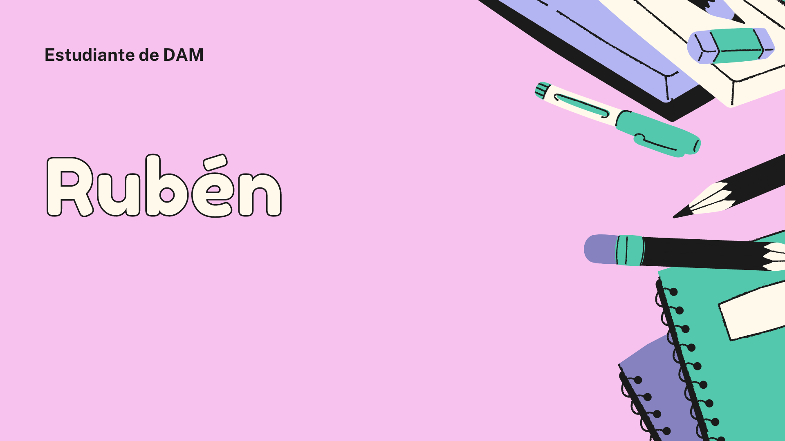
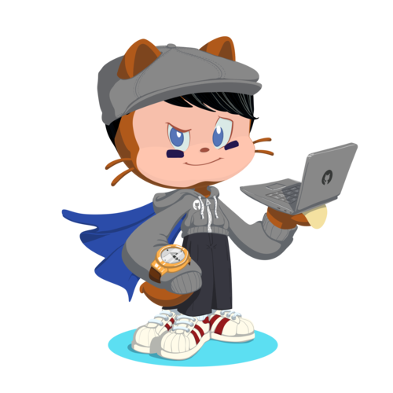

### <h1 align="center"> Hola, soy Rubén 👋
# <h1 align="center" width= "34" height= "32"> 

>## <h2 align= "center"> §Datos Personales§

* Nombre: Rubén García-Redondo Marín
* Edad: 19 años
* Estudiante

--------------------------------------------------------------------------------

>📚 Soy actualmente estudiante de 1º DAM en el IES Luis Vives. Desde hace varios me empezó a llamar la programación y decidí estduiar para sacar mi máximo potencial. 

--------------------------------------------------------------------------------

>🚀 Actualmente utilizo los siguientes lenguajes:

*  Java
*   TypeScript
*  JavaScript 
*  Git
*  SQL
*  HTML5

--------------------------------------------------------------------------------

> ## <h2 align= "center"> §Contacto§:

* Correo: ruben.garciaredondo@alumno.iesluisvives.org
* Discord: RuyMi#3479
* Instagram: rubengrm2002
* Twitter: rubengrm2002
* LinkedIn: [Rubén García-Redondo Marín][website]

--------------------------------------------------------------------------------

 ## <h2 align= "center"> §Redes Sociales§:

# <h1 align="center" width= "34" height= "32"> 

<!-- Links -->
[website]: https://www.linkedin.com/in/rubén-garc%C3%ADa-redondo-mar%C3%ADn-59b36b225/
